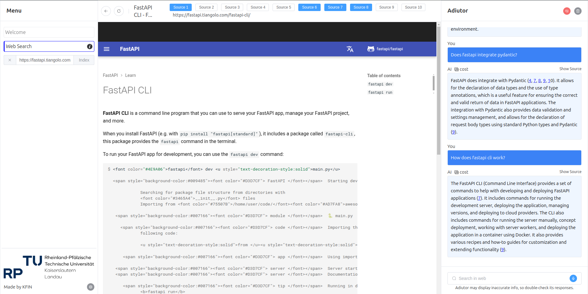

# Adiutor  

Adiutor is a lightweight web application that transforms websites into searchable knowledge bases for RAG-based chat systems. It is built with **OpenAI** (`gpt-3.5-turbo-1106`), **Crawl4AI**, **AWS Lambda**, **S3 Bucket**, and **Bedrock** (`amazon.titan-embed-text-v2:0`) for production use.

## 🚀 Getting Started  

## 📦 Deployment on AWS  

To deploy Adiutor to AWS, set up your environment variables and run the following commands:  

```bash
export AWS_DEFAULT_REGION=<your-region>
export AWS_ACCESS_KEY_ID=<your-access-key>
export AWS_SECRET_ACCESS_KEY=<your-secret-key>
export LLM_API_TOKEN=<your-llm-api-token>

cdk deploy CdkBackendStack --outputs-file backend.json
cdk deploy CdkFrontendStack --outputs-file frontend.json
```

## 🏗️ Running Locally

To run Adiutor locally, navigate to the `adiutor` directory and start the application using Docker Compose:  

```bash
docker compose up --build
```

## 🎨 Preview 

Below is a preview of Adiutor in action:  

